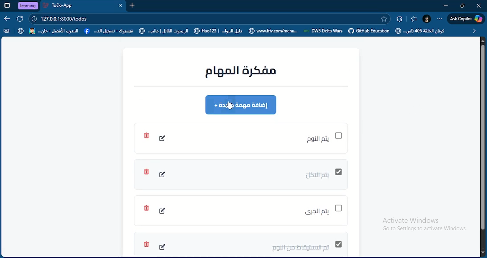
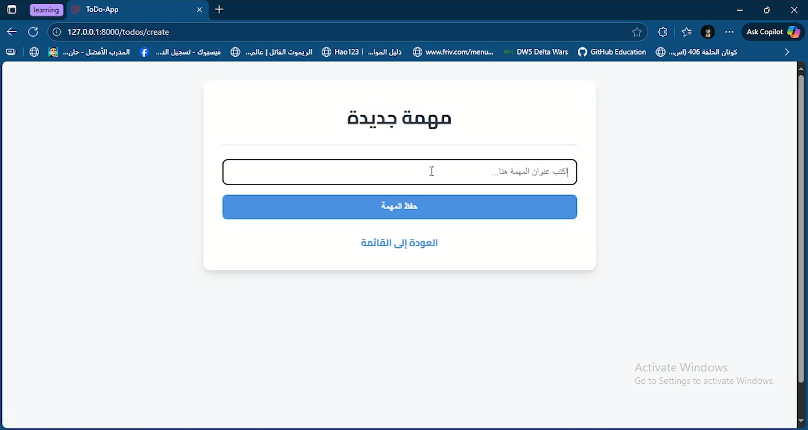

# ✅ Simple To-Do App

A simple and clean **To-Do web application** built using **Laravel, PHP, MySQL, HTML, CSS, and JavaScript**.
This project allows users to **add, edit, delete, and manage daily tasks** easily through a responsive and user-friendly interface.

---

## 🚀 Features

* ➕ Add new tasks
* ✏️ Edit existing tasks
* 🗑️ Delete tasks
* ✅ Mark tasks as completed
* 📱 Responsive design (works on mobile & desktop)
* 💾 Data stored securely in MySQL database
* ⚙️ Built using the **MVC structure of Laravel**

---

## 🧠 Tech Stack

| Layer     | Technology              |
| --------- | ----------------------- |
| Front-end | HTML, CSS, JavaScript   |
| Back-end  | PHP (Laravel Framework) |
| Database  | MySQL                   |
| Tools     | Composer, Artisan, Vite |

---

## 🏗️ Project Structure

```
project-root/
├── app/
├── bootstrap/
├── config/
├── database/
├── public/
├── resources/
├── routes/
├── storage/
├── tests/
├── .env.example
├── composer.json
├── package.json
├── vite.config.js
└── README.md
```

---

## ⚙️ Installation Guide

### 1️⃣ Clone the repository

```bash
git clone https://github.com/YourUsername/simple-todo-app.git
cd simple-todo-app
```

### 2️⃣ Install dependencies

```bash
composer install
npm install
```

### 3️⃣ Configure environment

* Create a copy of `.env.example` and rename it to `.env`
* Update your database credentials:

```env
DB_DATABASE=todo_app
DB_USERNAME=root
DB_PASSWORD=
```

### 4️⃣ Generate application key

```bash
php artisan key:generate
```

### 5️⃣ Run migrations

```bash
php artisan migrate
```

### 6️⃣ Start the local development server

```bash
php artisan serve
```

Then open your browser and go to:
👉 [http://127.0.0.1:8000](http://127.0.0.1:8000)

---

## 📸 Screenshots

Below are some example screenshots of the app interface:

### 🏠 Homepage



### 📝 Add Task Page




---

## 👨‍💻 Author

**Shady Algammal**

🎓 Computer Science Student at Tanta University.

💻 Passionate about Web Development & Cybersecurity.

🌐 [GitHub Profile](https://github.com/Sh-algammal).

🔗 [LinkedIn Profile](https://www.linkedin.com/in/shady-algammal).

---


## ⭐ Support

If you like this project, don’t forget to **star ⭐ the repository** and share it with others!
